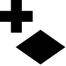
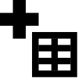

Getting Started
===============

This section gives a high level overview of using GeoCanvas. Read this first to get an idea of what GeoCanvas does. This may be enough to get you started if you're familiar with geographic information systems (GIS) or graphics applications that use layers to organize data.

The rest of the documentation fills in the details, and will be your main source of answers when you've got questions about how to do things, click by click. 

Using GeoCanvas is deceptively simple.
There are only four main steps:

1. Add shapes
2. Add attributes
3. Color shapes
4. Visualize in 3D

|addshapes| Add Shapes
----------------------

- From the File menu, select :menuselection:`New Shape Layer…`
- Select a shape (.shp) file OR connect to a PostGIS database and choose a table with geometry.
- Type a name in the :guilabel:`Layer Name` field and click :guilabel:`OK`.
- A new shape layer is added to the layer list.

More details here: :doc:`Adding Shapes`

|addattributes| Add Attributes
------------------------------

Note that this step *isn't* necessary if the layer you added already has attributes you want to visualize built-in! This is often the case with shapefiles. This step *is* required if the data you want to visualize is from a different file or table than the shapes.

- In the :guilabel:`layer panel`, click on the name of the shape layer you just added. This will make it the current layer, which is indicated with blue text.
- From the File menu, select :menuselection:`Add Attributes to Layer…`
- Select a file with attributes to join to the current shape layer, and specify which field to join to. 
- Click :guilabel:`OK`. You can then select the file or table you just added to the layer as a :guilabel:`data set` for that layer. More on that in the next step.

More details here: :doc:`Adding Attributes`

|colorshapes| Color Shapes
--------------------------

Now that you've got shapes and attributes, you use the attributes to paint the shapes, that is to "theme" them. 

Theming is done on a layer by layer basis, so the controls for theming are located in the layer panel, and accessible for each layer.

- Click the arrow to the right of the layer name you'd like to theme. This reveals the layer controls.
- From the :guilabel:`Data Set` drop down box, select the source of the attributes you'd like to visualize. You can use attributes native to the shape layer, or ones that you add yourself.
- Pick the specific attribute to use for theming from the :guilabel:`Data Field` drop down box.
- Select a color scheme, a type of interval, and a number of bins. Generally, more bins look better. The particulars of what all that means will be explained in the detailed theming section.

More details here: :doc:`Theming`

|visualizein3d| Visualize in 3D
-------------------------------

This step is the heart of GeoCanvas, and where things get interesting! It's also the easiest part. 

- At the bottom of the layer controls for the active layer, click the :guilabel:`Extrusion` tab. This will automatically show the layer in 3D, which is indicated by the cube icon next to the layer name. 
- Choose the :guilabel:`Data Set` and :guilabel:`Data Field` as you did to color the shapes. The values of the selected attribute will be used to extrude the shapes.
- If the 3D shapes are way too big or way too small, experiment with changing the scale factor. 

More details here: :doc:`Theming`

