Layer Controls
==============

Current Layer
-------------

At any time, only one layer can be the :guilabel:`current layer` even though many layers may be visible. 

**To make a layer current, click its name in the layer panel.**

- The current layer is the shape layer to which new attributes are added when :menuselection:`Add Attributes to Layer` is selected from the File menu. 
- The current layer is also the selectable layer. Only shapes on the current layer can be selected with the selection tool.

Only shape layers can be made the current layer. So when GeoCanvas starts, there is no current layer, since there are only base map layers to start.

The name current layer will be shown in blue. All other layer names will be shown in black. (Clicking base map layer names has no effect.)

Visibility Toggle
-----------------

The control to the left of a layer's name in the layer panel is its :guilabel:`visibility toggle`. The :guilabel:`visibility toggle` indicates whether is layer is Off |layer_off|, 2D |layer_2d|, or 3D |layer_3d|.

- Base map layers can be Off |layer_off|, or 2D |layer_2d|. 
- Shape layers can be Off |layer_off|, 2D |layer_2d|, or 3D |layer_3d|.

**To switch between modes, click on the icon.**

.. note:: The `Visibility Limit`_ control (explained below) also determines the visibility of shape layers. If your layer is not appearing, first make sure it's in 2D or 3D mode, and then check its visibility limit.

Show / Hide Controls
--------------------

The arrow to the right of the layer name shows and hides additional controls for each layer. There are a common set of controls shown for all layers, plus some that depend on the layer type, that is, whether layer is a base map layer or shape layer. 

Layer Up and Down
-----------------

|layerUp| and |layerDown| move layers up and down in the list. 

Layers closer to the top of the list are drawn above layers lower in the list.

Opacity
-------

The opacity slider controls how much you can see through the layer to layers below.

Background Image
----------------

The :guilabel:`Background Image` control is only available for base map layers. This drop down menu lets you select which set of images to use; e.g. Aerial photos, conventional street maps, labels, or stylized maps.

.. image:: images/layercontrols-basemap.png
   :scale: 50 %

Outline Visibility
------------------

|outlineOn| This icon indicates outlines are shown. Click to hide. Only available for shape layers.

|outlineOff| This icon indicates outlines are hidden. Click to show. Only available for shape layers.

Delete Layer
------------

|layerDelete| Click to delete layer. Only available for shape layers.

Visibility Limit
----------------

This is the :guilabel:`visibility limit` control.

**A black line is shown beneath all of the zoom levels at which the current layer is visible.**

- Click the |globe| icon to make the layer *visible* at greater distances.

- Click the |house| icon to make the layer *hidden* at greater distances.

|limitsIn|

Each colored dash represents a :guilabel:`zoom level`. The zoom level corresponds to the distance of your viewpoint from the surface. Zoom levels toward the left are further from the surface.

The magnifying glass is shown above the current zoom level. Change the current zoom level with the |zoomIn| :guilabel:`zoom in` and |zoomOut| :guilabel:`zoom out` buttons on the toolbar. 

When the magnifying glass is within the range of zoom levels with a black underline, (as shown below) the layer will be **visible**.
|limitsIn|

When the magnifying glass is outside the range of zoom levels with a black underline, (as shown below) the layer will be **hidden**.
|limitsOut| 

.. note:: While it's tempting to make all layers visible at the maximum possible distance, it's not always a good idea. The more shapes that are visible, the more likely things are to slow down. Depending on how much memory your computer has, showing too much at once could cause pretty significant performance issues.

The colors of the dashes indicate which zoom levels are likely to result in a good balance of performance versus convenience.

- **Green** dashes indicate *recommended* zoom levels.
- **Yellow** dashes indicate *allowed* zoom levels.
- **Red** dashes indicate *forbidden* zoom levels.

If you're experiencing sluggish performance, or crashes, try reducing the visibility limit. That is, make the black line shorter for layers that have many, or very detailed shapes.

Theme Controls
--------------

The remainder of the layer controls are described in the :doc:`Theming` section.

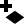

.. |layerDelete| image:: images/layerDelete@2x.png
   :scale: 50 %

.. |layerDown| image:: images/layerDown@2x.png
   :scale: 50 %

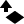

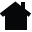

.. |globe| image:: images/globe@2x.png
   :scale: 50 %

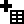

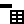

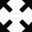

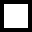

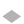

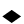

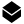

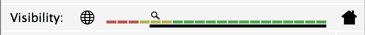

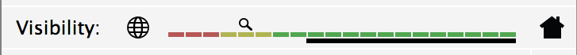

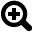

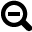

