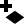
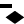
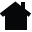
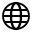
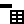
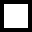
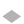
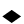
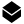

Layer Controls
==============

Current Layer
-------------

At any time, only one layer can be the :guilabel:`current layer` even though many layers may be visible. 

- The current layer is the shape layer to which new attributes are added when :menuselection:`Add Attributes to Layer` is selected from the File menu. 
- The current layer is also the selectable layer. Only shapes on the current layer can be selected with the selection tool.

Only shape layers can be made the current layer. So when GeoCanvas starts, there is no current layer, since there are only base map layers to start.

**To make a layer current, click its name in the layer panel.**

The name current layer will be shown in blue. All other layer names will be shown in black. (Clicking base map layer names has no effect.)

Visibility Toggle
-----------------

The control to the left of a layer's name in the layer panel is its :guilabel:`visibility toggle`. The :guilabel:`visibility toggle` indicates whether is layer is Off |layer_off|, 2D |layer_2d|, or 3D |layer_3d|.

- Base map layers can be Off |layer_off|, or 2D |layer_2d|. 
- Shape layers can be Off |layer_off|, 2D |layer_2d|, or 3D |layer_3d|.

**To switch between modes, click on the icon.**

.. note:: The `Visibility Limit`_ control (explained below) also determines the visibility of shape layers. If your layer is not appearing, first make sure it's in 2D or 3D mode, and then check its visibility limit.

Show / Hide Controls
--------------------

The arrow to the right of the layer name shows and hides additional controls for each layer. There are a common set of controls shown for all layers, plus some that depend on the layer type, that is, whether layer is a base map layer or shape layer. 

Layer Up and Down
-----------------

|layerUp| and |layerDown| move layers up and down in the list. 

Layers closer to the top of the list are drawn above layers lower in the list.

Opacity
-------

The opacity slider controls how much you can see through the layer to layers below.

Background Image
----------------

The :guilabel:`Background Image` control is only available for base map layers. This drop down menu lets you select which set of images to use; e.g. Aerial photos, conventional street maps, labels, or stylized maps.

.. image:: layercontrols-basemap.png
   :scale: 50 %

Outline Visibility
------------------

|outlineOn| This icon indicates outlines are shown. Click to hide. Only available for shape layers.

|outlineOff| This icon indicates outlines are hidden. Click to show. Only available for shape layers.

Delete Layer
------------

|layerDelete| Click to delete layer. Only available for shape layers.

Visibility Limit
----------------

|limitsIn|

|limitsOut| 
 
Click the |house| icon to make the layer *visible* at greater distances.

Click the |globe| icon to make the layer *invisible* at greater distances.

Theme Controls
--------------

The remainder of the layer controls are described in the :doc:`Theming` section.

.. |layerDown| image:: layerDown@2x.png
   :scale: 50 %

.. |layerUp| image:: layerUp@2x.png
   :scale: 50 %

.. |dataAdd| image:: dataAdd@2x.png
   :scale: 50 %

.. |zoomExtents| image:: zoomextents@2x.png
   :scale: 50 %

.. |limitsIn| image:: limitsIn.png
   :scale: 50 %

.. |limitsOut| image:: limitsOut.png
   :scale: 50 %

