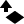
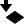
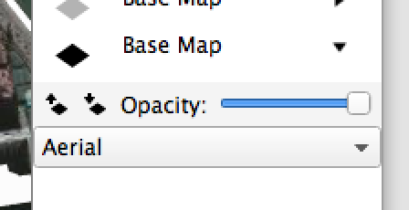
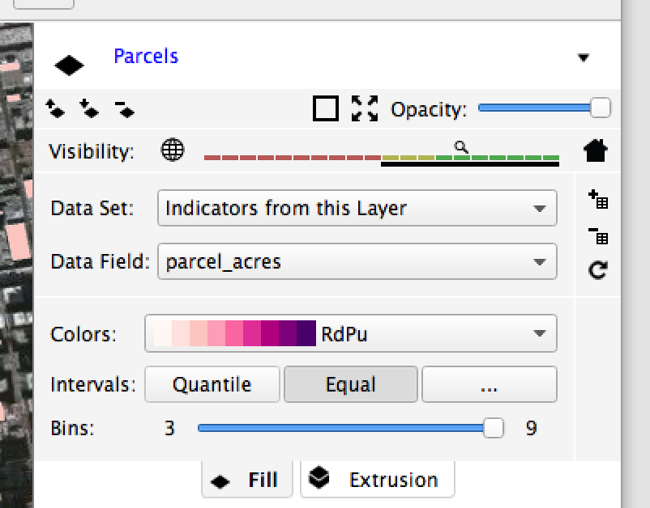
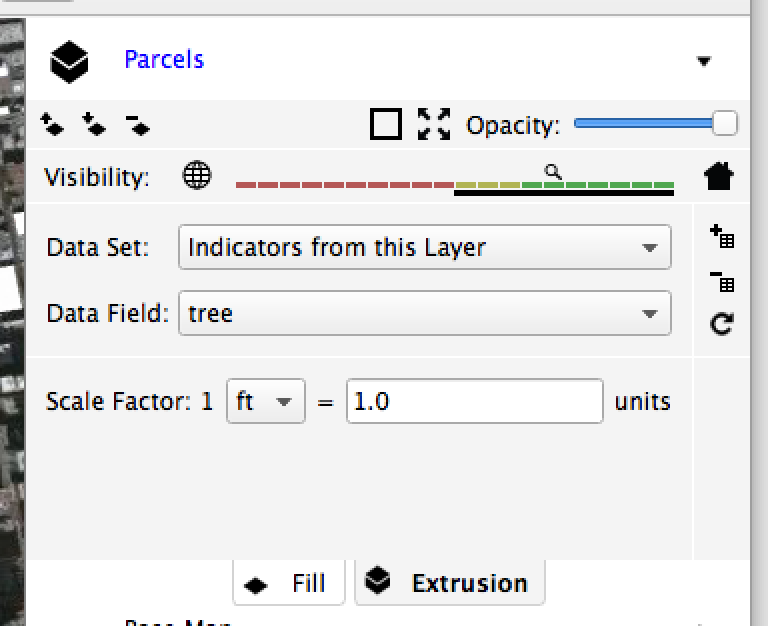

Layer Controls
==============

Current Layer
-------------

At any time, only one layer can be the :guilabel:`current layer` even though many layers may be visible. 

- The current layer is the shape layer to which new attributes are added when :menuselection:`Add Attributes to Layer` is selected from the File menu. 
- The current layer is also the selectable layer. Only shapes on the current layer can be selected with the selection tool.

Only shape layers can be made the current layer. So when GeoCanvas starts, there is no current layer, since there are only base map layers to start.

**To make a layer current, click its name in the layer panel.**

The name current layer will be shown in blue. All other layer names will be shown in black. (Clicking base map layer names has no effect.)

Visibility Toggle
-----------------

The control to the left of a layer's name in the layer panel is it's :guilabel:`visibility toggle`. The :guilabel:`visibility toggle` indicates whether is layer is Off, 2D, or 3D.

- Base map layers can be Off, or 2D. 
- Shape layers can be Off, 2D, or 3D.

**To switch between modes, click on the icon.**

.. note:: The :guilabel:`visibility limit` control (explained below) also determines the visibility of shape layers. If your layer is not appearing, first make sure it's in 2D or 3D mode, and then check it's visibility limit.

Show / Hide Layer Controls
--------------------------

Shows additional controls for each layer. Which controls are shown depends on the type of layer - that is, whether the layer is a base map layer or shape layer. There are also a common set of controls shown for all layers

Common Controls
---------------

Move Layer Up
~~~~~~~~~~~~~

Move Layer Down
~~~~~~~~~~~~~~~

Opacity
~~~~~~~

Base Map Layer Controls
-----------------------

Background Image
~~~~~~~~~~~~~~~~

Shape Layer Controls
--------------------

Outline Visibility
~~~~~~~~~~~~~~~~~~

Delete Layer
~~~~~~~~~~~~

Visibility Limits
~~~~~~~~~~~~~~~~~

Fill Controls
~~~~~~~~~~~~~

Fill Controls:

Attribute Source
^^^^^^^^^^^^^^^^

Theme Options
^^^^^^^^^^^^^

Extrusion Controls
~~~~~~~~~~~~~~~~~~

Attribute Source
^^^^^^^^^^^^^^^^

Theme Options
^^^^^^^^^^^^^