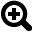

Learn the Interface
===================

.. image:: images/GeoCanvasInterfaceMain.png
   :scale: 50 %

.. |zoomout| image:: images/zoomOut@2x.png
   :scale: 50 %

.. |select| image:: images/selectByClick@2x.png
   :scale: 50 %

.. |deselect| image:: images/selectClear@2x.png
   :scale: 50 %

3D View
-------

The 3D view is the main GeoCanvas workspace. Actually, it IS the GeoCanvas itself, where all the data you import shows up in a 3D, interactive environment. 

Toolbar
-------

The toolbar has a set of tools that help you navigate the 3D view, select objects, and capture screenshots. For a quick reference on getting around the 3D view, you can always access a list of shortcuts by choosing "Shortcuts..." from the "Help" menu.

|pan| Pan

|tilt| Tilt 

|lookdown| Look Down

|zoomin| Zoom In

|zoomout| Zoom Out

|select| Select

|deselect| De-select All

|camera| Capture Screenshot

To capture a screenshot, first get the 3D view looking the way you'd like by navigating around and theming layers. Then, either:

- Click the "Capture Screenshot" button on the toolbar
- Select "Capture Screenshot" from the "View" menu
- Use the keyboard shortcut: "Command-S" on Mac, or "Control-S" on Windows.

Screenshots will be saved as PNG images in a folder named "screenshots" in the same place GeoCanvas is installed on your computer. The filename will be given a name starting with "img" followed by the date and time, like this: img_2013-11-02_11-33-19.png, that is, img_YYYY-MM-DD_HH-MM-SS.png.

Panels
------

Layer Panel
***********

Everything you see in the 3D view is organized into layers. Layers allow you to organize and independently control the appearance of different data sets. In GeoCanvas, there are two main types of layers - base map layers and shape layers.

Base map layers are built in to GeoCanvas. Each base map layer provides a set of photographic and diagrammatic images covering the whole world. There are aerial photos, street maps, labels, and some stylized graphic options. Two base map layers are provided. You can use one, both, or neither, by turning each one on and off. By changing the image source and the opacity of each one, that is, how much you can see through it, you can create a huge variety of looks.

Shape layers are groups of discreet geographic features, such as polygons representing building footprints, or points representing bus stops. Shape layers can come from two main types of sources: Files, or Databases. See the section above on shapes for details on where you can get shape data.

Legend Panel
************

`… todo …`

Table Panel
***********

`… todo …`

