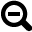

Learn the Interface
===================

.. image:: images/GeoCanvasInterfaceMain.png
   :scale: 50 %

.. |pan| image:: images/hand@2x.png
   :scale: 50 %

.. |tilt| image:: images/tilt@2x.png
   :scale: 50 %

.. |lookdown| image:: images/viewTopDown@2x.png
   :scale: 50 %

.. |zoomin| image:: images/zoomIn@2x.png
   :scale: 50 %

.. |camera| image:: images/camera@2x.png
   :scale: 50 %

3D View
-------

The 3D view is the main GeoCanvas workspace. Actually, it IS the GeoCanvas itself, where all the data you import shows up in a 3D, interactive environment. 

Toolbar
-------

The toolbar has a set of tools that help you navigate the 3D view, select objects, and capture screenshots. For a quick reference on getting around the 3D view, you can always access a list of shortcuts by choosing "Shortcuts..." from the "Help" menu.

|pan| Pan

|tilt| Tilt 

|lookdown| Look Down

|zoomin| Zoom In

|zoomout| Zoom Out

|select| Select

|deselect| De-select All

|camera| Capture Screenshot

To capture a screenshot, first get the 3D view looking the way you'd like by navigating around and theming layers. Then, either:

- Click the "Capture Screenshot" button on the toolbar
- Select "Capture Screenshot" from the "View" menu
- Use the keyboard shortcut: "Command-S" on Mac, or "Control-S" on Windows.

Screenshots will be saved as PNG images in a folder named "screenshots" in the same place GeoCanvas is installed on your computer. The filename will be given a name starting with "img" followed by the date and time, like this: img_2013-11-02_11-33-19.png, that is, img_YYYY-MM-DD_HH-MM-SS.png.

Layer Panel
-----------

Everything you see in the 3D view is organized into layers. Layers allow you to organize and independently control the appearance of different data sets. In GeoCanvas, there are two main types of layers - base map layers and shape layers.

Base map layers are built in to GeoCanvas. Each base map layer provides a set of photographic and diagrammatic images covering the whole world. There are aerial photos, street maps, labels, and some stylized graphic options. Two base map layers are provided. You can use one, both, or neither, by turning each one on and off. By changing the image source and the opacity of each one, that is, how much you can see through it, you can create a huge variety of looks.

Shape layers are groups of discreet geographic features, such as polygons representing building footprints, or points representing bus stops. Shape layers can come from two main types of sources: Files, or Databases. See the section above on shapes for details on where you can get shape data.

Legend Panel
------------

The Legend Panel contains a legend showing the minimum and maximum values associated with each color.  Only one legend is shown at a time. The active legend corresponds to the most recent attribute (i.e. Data Field) selected for theming, which is reflected in the legend's title.

Toggling Visibility
*******************

The legend can be turned on and off by selecting :menuselection:`Legend` from the :guilabel:`View` menu.

Customizing
***********

To customize the legend, change the theme settings for the layer to which it corresponds. See the :doc:`Layer Controls` section for details on modifying the color scheme and breakpoints.

Table Panel
-----------

The Table Panel gives you a tabular view of the data in each shape layer.

Toggling Visibility
*******************

The table panel can be turned on and off by selecting :menuselection:`Table` from the :guilabel:`View` menu.

Current Table
*************

The drop down box in the upper left of the table panel contains a list of all the current shape layers. Select a layer here to see it in the table.

Show Selection Only
*******************

The "Show Selection Only" checkbox works in conjunction with the selection tools in the toolbar. Here's a typical workflow that is useful for finding out details of specific shapes in the 3D view.

- Make the selection tool active by clicking on its toolbar icon: |select|.
- Make a shape layer active by clicking on its name in the layer panel. This will make it the current layer, and selectable. See the :doc:`Layer Controls` section for more on the "current layer" concept.
- Click on some shapes in the 3D view. Be sure you're zoomed in close enough to see them first!
- Click "Show Selection Only" in the table view. **This will cause only the items that you selected in the 3d view to show up in the table.** 
- To all deselect items in the 3D view, click the de-select toolbar button: |deselect|.

Zoom to Selection
*****************

The "Zoom to Selection" feature is used to automatically zoom the 3D view to shapes you select in the table. 

To try it out, do this:

- First deselect all shapes, using the :guilabel:`Deselect All` tool: |deselect|.
- Be sure the current layer in the layer panel is the same as the layer shown in the table view.
- Be sure the box next to "Zoom to Selection" is checked.
- Click on an item in the *table* view.
- If the item is not in the 3D view already, the 3D view will automatically pan over to show you the item you selected. 
- To turn off this behavior, un-check the box next to "Zoom to Selection"

Filters
*******

You can restrict the items in the table view by applying filters.

To apply a filter:

- Set the filter criteria you'd like to use with the drop downs and text field(s) to the right of the "Apply filter" label, at the upper right of the table panel.
- Then, check the box next to "Apply filter" and your criteria will be used to filter the table. Only records that meet the criteria will be shown.

.. note:: If you wish, you can then use the keyboard shortcut for "Select All" - Command-A on Mac, and Control-A on Windows - on the table. This will highlight all the shapes that meet your criteria in **both** the table view and the 3d view. This is a good way to find shapes with certain attributes in the 3d view.

