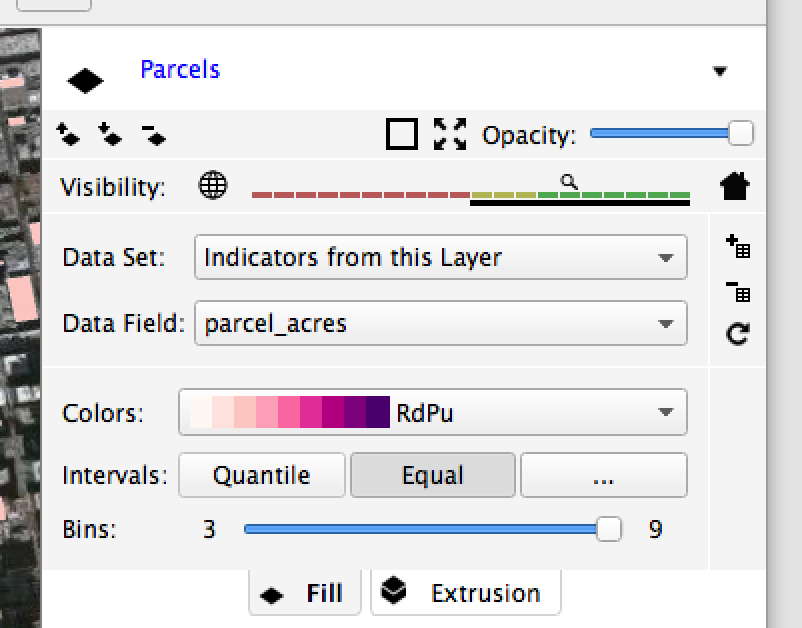
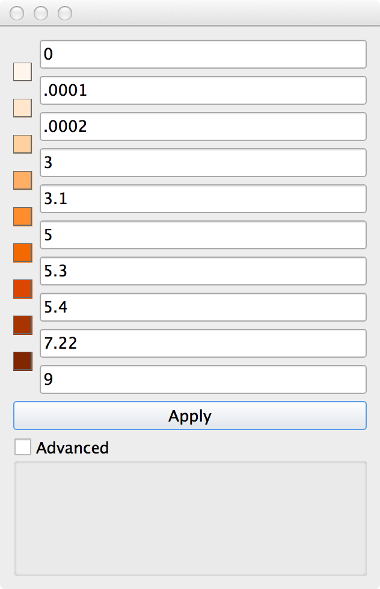
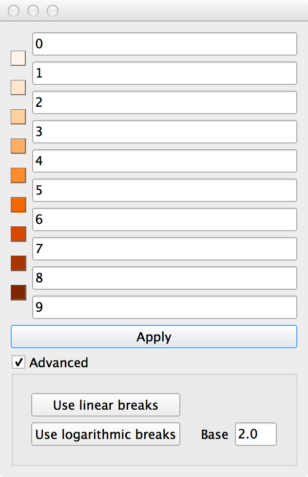
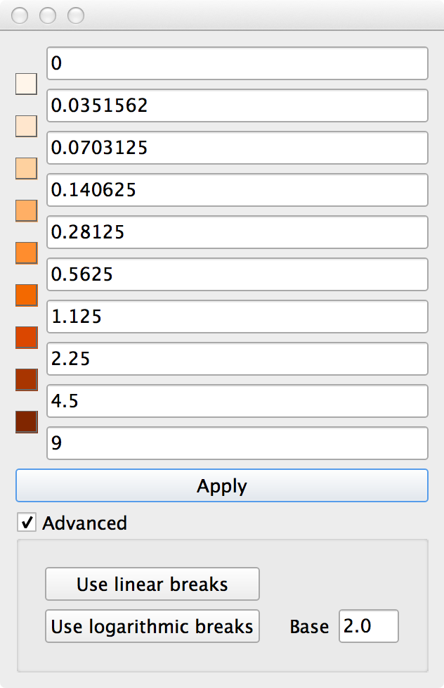
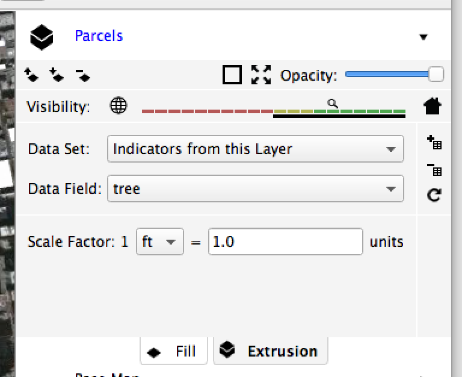

Theming
=======

**Theming is how you visualize data.**

In GeoCanvas, theming is done on a layer-by-layer basis. By theming a shape layer, you are determining how the shapes are colored or how tall they are when they are extruded into 3D volumes.

Each shape layer has a set of theming controls located directly below the :guilabel:`visibility limit` controls. The theme controls are separated out into two tabs: the **Fill** tab and the **Extrusion** tab.

To create a data visualization, you need to specify two main things: *the data source*, and *the aspect of the visualization that is controlled by that data.*

Accordingly, the **Fill** and **Extrusion** tabs are split into two parts:

- Data Source (the top half)
- Theme Settings (the bottom half)

The :guilabel:`Data Source` section looks the same on both tabs. There are two things to choose in this section; the :guilabel:`Data Set` and the :guilabel:`Data Field`.

The :guilabel:`Data Set` is the original source of the data that you'd like to use to either color or extrude shapes. Some shape layers have built-in attributes - columns of data associated with shapes. These built-in attributes can be accessed by selecting "Indicators from this layer" in the :guilabel:`Data Set` drop down box. If you've added any additional attributes from files or database tables, you can select the name of the original file or table here.

Once the data is selected, you'll see that the :guilabel:`Data Field` drop down gets filled with a set of options that correspond to the numeric fields in the source data set.

The :guilabel:`Data Field` is the column of data (a.k.a. the "indicator" or "attribute") that you'll be visualizing on each shape.

Fill
----

Once you've selected a :guilabel:`Data Source` for Fill by choosing a :guilabel:`Data Set` and :guilabel:`Data Field`, you specify how that gets translated into colors on shapes in the :guilabel:`Theme Settings` section. This section has three controls: :guilabel:`Colors`, :guilabel:`Bins` and :guilabel:`Intervals`.
 

Colors
~~~~~~

Select a color scheme for the visualization from this drop down.

.. note:: Different color schemes provide different numbers of bins (explained below). Most of the schemes allow between 9 and 12 bins. The number of bins you can select is dependent on the color scheme, so the min. and max. values of the :guilabel:`Bins` slider will change with the color scheme selection. Try different combinations of schemes and bins to see what works best for your data.

Bins
~~~~

The number of bins is the number of colors used to represent attributes on shapes. Each bin corresponds to a single color, and a minimum and maximum attribute value. If a shape's  attribute value falls within a bin's range, it is colored with the bin's color. 

You can see the ranges associated with each bin in the :guilabel:`Legend Panel`.

.. note:: If the legend panel is not visible, you can show it by selecting :menuselection:`Legend` from the :guilabel:`View` menu. 

The minimum and maximum values associate with each bin are determined by the :guilabel:`Intervals` settings.

Intervals
~~~~~~~~~

The :guilabel:`Intervals` setting determines where the breakpoints between bins are set. There are three types:

- **Quantile**
- **Equal**
- **Custom**

Using **Quantile** intervals results in bins with approximately the same *number of shapes* per bin. There may be very different intervals between the breakpoint values.

Using **Equal** intervals results in bins with *breakpoint values* set at equal intervals. There may be very different numbers of shapes in each bin.

Using **Custom** intervals allows you to set the breakpoints between bins manually. This is done in the :guilabel:`Custom Intervals` dialog box, which can be opened by clicking the :guilabel:`Custom…` button.

There are a few ways you can use the :guilabel:`Custom Interval` dialog. 

**Manual Entry**

Specify each value, then click :guilabel:`Apply`

**Linear Breaks**

With :guilabel:`Advanced` checked, enter the minimum and maximum values, then click :guilabel:`Use linear breaks`, and the intermediate values will be calculated as set of even intervals between the start and end value. Then, click :guilabel:`Apply`

**Logarithmic Breaks**

With :guilabel:`Advanced` checked, enter the minimum and maximum values, then click :guilabel:`Use logarithmic breaks`, and the intermediate values will be calculated as set of intervals between the start and end value, spaced logarithmically. You have the option of specifying the logarithmic base as well. Then, click :guilabel:`Apply`

Extrusion
---------

The **Extrusion** tab lets you choose what attributes are used to calculate the height of shapes. This allows you to turn shapes into 3D volumes, i.e. to "extrude" them.

The Data Set and Data Field options work just like the corresponding fields in the Fill tab.

.. note:: The Data Set and Data Field for extrusions are INDEPENDENT from the Fill tab's controls for Data Set and Data Field. This means that you can choose one attribute to color shapes, and a different attribute to determine the shape's height! If you want them to be the same, you need to set them to the same values explicitly.

.. note:: As soon as you click the "Extrusion" tab for a layer, that layer will be shown in 3D mode. To get cycle back to 2D mode, click the icon to the left of the layer name twice (once turns the layer off, and twice brings you back to 2D mode.)

Scale Factor
~~~~~~~~~~~~

The :guilabel:`Scale Factor` is the way to specify the transformation from attribute values to heights. At first, it may seem a bit counterintuitive, but you enter a smaller unit value if you want the shapes to be taller.

So:

If 3D extrusions are too short, try a lower value for units.

If 3D extrusions are too tall, try a higher value for units.

Typically, experimenting by changing the unit value by factors of ten gets you in the ballpark pretty quickly.

